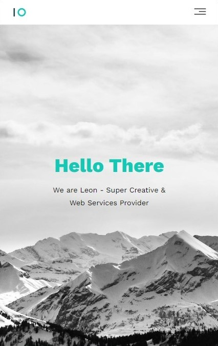

# Leon Agnecy Landing Page

Leon Agency is a landing page for a fictional agency that provides cutting-edge digital solutions! 
Which believe in transforming ideas into impactful digital experiences. 
The agency is dedicated to providing innovative solutions that empower businesses to thrive in the digital landscape.

Hosted at -> https://leon-agency-services.netlify.app

## Technologies & Design Approach

 Implemented a mobile-first approach to ensure optimal user experience across various devices
, Employed a grid-based layout system using CSS grid and flexbox for structuring and organizing content
, Carefully selected a color palette that prioritizes readability and visibility
, Implemented SEO best practices to improve the landing page's search engine visibility
, Tested the landing page across various browsers to ensure compatibility.

## Demo Images

 

 

 
Implementing the use of CSS grid makes for seamless responsive experience across varies screen sizes
 

 

 

 

